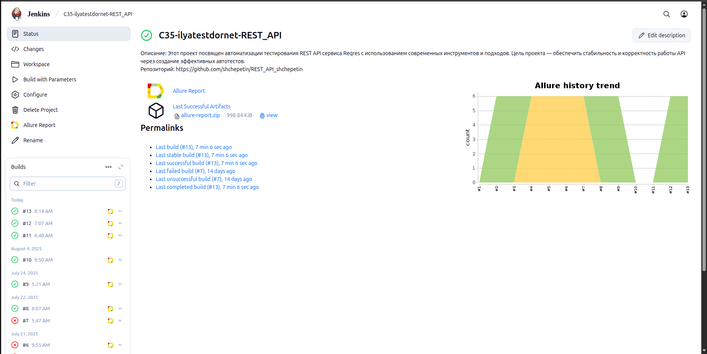
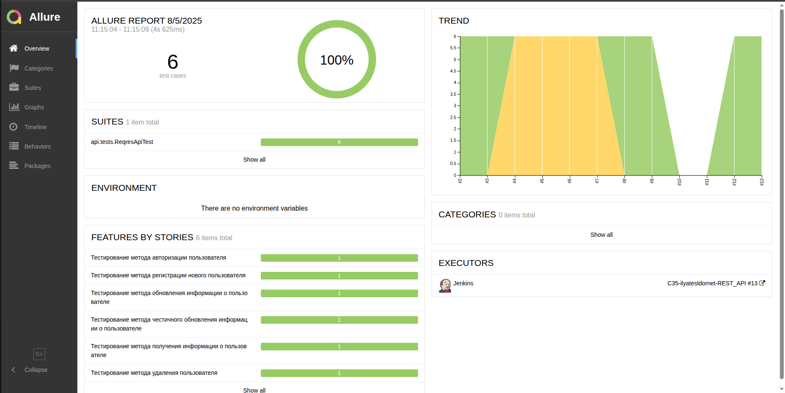
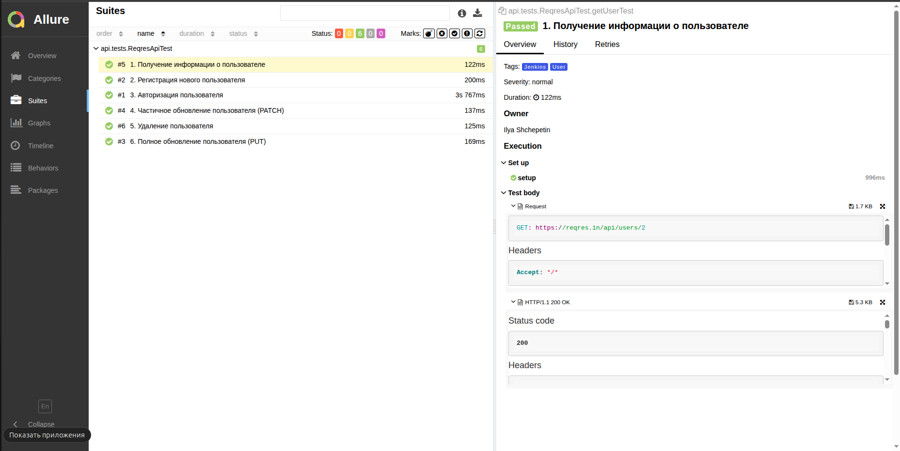
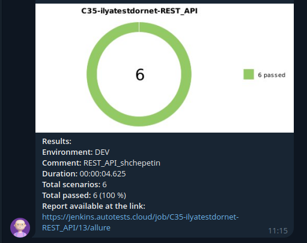

# Проект по автоматизации тестирования API сервиса Reqres

## Введение
Данный проект представляет собой набор автоматизированных тестов для API сервиса Reqres. Он предназначен для проверки корректности работы основных функций API, таких как регистрация, авторизация, управление пользователями и получение данных.

---

## Содержание:

- [Используемые технологии и инструменты](#используемые-технологии-и-инструменты)
- [Реализованные тестовые сценарии](#реализованные-тестовые-сценарии)
- [Запуск тестов из командной строки](#запуск-тестов-из-командной-строки)
- [Настройка и запуск сборки в Jenkins](#настройка-и-запуск-сборки-в-jenkins)
- [Отчет Allure](#отчет-allure)
- [Уведомления в Telegram через бота](#уведомления-в-telegram-через-бота)
- [Контакты](#контакты)

---

## Используемые технологии и инструменты:

| [Java](https://www.java.com/) | [IDEA](https://www.jetbrains.com/idea/) | [GitHub](https://github.com/) | [JUnit 5](https://junit.org/junit5/) | [Gradle](https://gradle.org/) | [Rest-Assured](https://rest-assured.io/) | [Allure](https://github.com/allure-framework) | [Jenkins](https://www.jenkins.io/) | [Telegram](https://web.telegram.org/) |
|---|---|---|---|---|---|---|---|---|
|  |  |  |  |  |  |  |  |  |

Проект автоматизации тестирования реализован на языке **Java** с применением фреймворков **JUnit 5**, **Selenide** (хотя иконка для Rest-Assured, в тексте указан Selenide - проверьте, что используется) и **Rest-Assured**. Управление проектом осуществляется с помощью сборочного инструмента **Gradle**. Для автоматизированного запуска тестов настроена задача в **Jenkins**, которая генерирует подробный **Allure-отчет** и отправляет результаты выполнения в **Telegram-канал** посредством специализированного бота.

---

## Реализованные тестовые сценарии

- ✓ Тестирование получения информации о пользователях
- ✓ Тестирование регистрации новых пользователей
- ✓ Тестирование авторизации пользователей
- ✓ Тестирование частичного обновления данных пользователя (PATCH-запрос)
- ✓ Тестирование удаления пользователя
- ✓ Тестирование полного обновления данных пользователя (PUT-запрос)

---

### Запуск тестов из командной строки
Для выполнения тестов локально используйте команду:

`gradle clean test`

---

## Настройка и запуск сборки в Jenkins

 Настройка и запуск сборки в [Jenkins]([ВАША_ССЫЛКА_НА_JENKINS])

Для запуска автоматизированной сборки перейдите в раздел `Собрать с параметрами`, выберите необходимые конфигурации и активируйте процесс нажатием кнопки `Собрать`.

По завершении сборки в блоке `История сборок` рядом с номером сборки появится иконка Allure Report. При нажатии на неё откроется сформированный HTML-отчет, содержащий всю тестовую документацию.

---

## Отчет Allure

 [Allure]([ВАША_ССЫЛКА_НА_ALLURE]) отчет

### Обзорная страница отчета

### Детализация тест-кейсов

---

## Уведомления в Telegram через бота

 Уведомления в Telegram-чат с ботом

После успешного выполнения сборки специально настроенный бот в **Telegram** автоматически формирует и отправляет сообщение с кратким отчетом о результатах прохождения тестов.

### Пример уведомления из чат-бота

#### Содержание уведомления в Telegram

- :heavy_check_mark: Используемое окружение
- :heavy_check_mark: Дополнительный комментарий к сборке
- :heavy_check_mark: Общая длительность выполнения тестов
- :heavy_check_mark: Суммарное количество тестовых сценариев
- :heavy_check_mark: Процент успешно пройденных тестов
- :heavy_check_mark: Прямая ссылка на полный Allure-отчет

---

## Контакты
* **GitHub:** [shchepetin](https://github.com/shchepetin)
* **Email:** shchepetin.i@dornet.ru
* **Место работы:** dornet
* **Город:** Москва, Россия

---